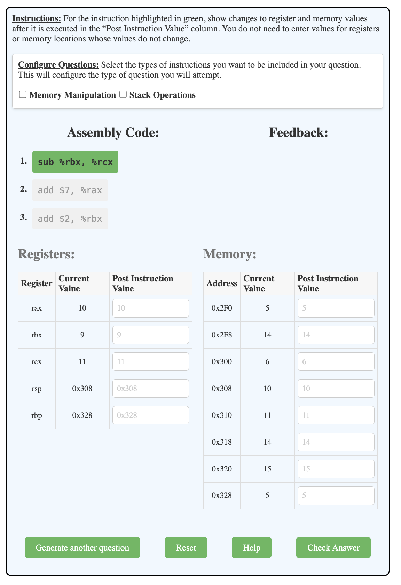
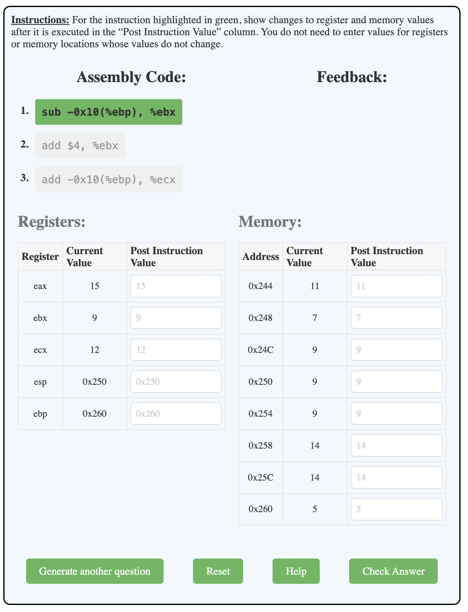

# Assembly Exercises: Enhanced Guide

This guide covers three types of Assembly-related exercises, with a particular focus on the Assembly State exercise. Each component is designed to test and improve your understanding of assembly language concepts.

## 1. Assembly Operations (`assembly`)

### Purpose
This exercise tests your ability to identify valid and invalid assembly language instructions.

### Supported Architectures
- IA32 (including X86_32 and X86_64)
- ARM64

### Exercise Structure
- Users are presented with assembly instructions containing operators and operands.
- The task is to determine whether each instruction is valid or invalid.

### Examples

#### IA32 (X86_32)
```html
<div data-component="assembly_syntax" data-question_label="1" id="q_test_x86_32">
  <script type="application/json">
    {
      "bits": 4,
      "architecture": "X86_32"
    }
  </script>
</div>
```

#### ARM64
```html
<div data-component="assembly_syntax" data-question_label="3" id="q_test_arm64">
  <script type="application/json">
    {
      "bits": 4,
      "architecture": "ARM64"
    }
  </script>
</div>
```

## 2. Assembly State Exercise (`assembly_state`)

### Purpose
This exercise evaluates your ability to analyze and predict the state of a system after executing a series of assembly instructions.

### Supported Architectures
- IA32 (including X86_32 and X86_64)
- ARM64

### Tunable parameters

### In User Interface



This is the default component appearance. You can generate different types of instructions by selecting from the following checkboxes:

- **Arithmetic Operation (hidden)**: Includes add and sub for both x86 and ARM architectures.
- **Memory Manipulation**: Includes mov for x86 and ldr, str for ARM.
- **Stack Operations**: Includes push and pop for x86.

### In PreTeXt file

The exercise is presented as a customized component with four key tunable elements:

1. **Instructions**: List of assembly instructions to be executed.
2. **Registers**: Initial register states, including:
   - Regular registers (e.g., eax, ebx, ecx)
   - Memory-related registers (e.g., esp, ebp)
3. **Memory**: Initial memory states, showing:
   - Memory addresses
   - Relative locations (e.g., -56, -48)
   - Values stored at each location
4. **Selection**: Boolean array indicating which instructions to execute

### Example (IA32 X86_64)



```html
<div data-component="assembly_state" data-question_label="1" id="test-assembly-state-ia64-div-unique-2">
  <script type="application/json">
    {
      "bits": 4,
      "architecture": "X86_64",
      "instructions": [
        "sub -0x10(%ebp), %ebx",
        "add $4, %ebx",
        "add -0x10(%ebp), %ecx"
      ],
      "registers": [
        { "register": "eax", "value": "15", "type": "regular" },
        { "register": "ebx", "value": "9", "type": "regular" },
        { "register": "ecx", "value": "12", "type": "regular" },
        { "register": "esp", "value": "0x250", "type": "memory" },
        { "register": "ebp", "value": "0x260", "type": "memory" }
      ],
      "memory": [
        { "address": "0x244", "location": "-56", "value": "11" },
        { "address": "0x248", "location": "-48", "value": "7" },
        { "address": "0x24C", "location": "-40", "value": "9" },
        { "address": "0x250", "location": "-32", "value": "9" },
        { "address": "0x254", "location": "-24", "value": "9" },
        { "address": "0x258", "location": "-16", "value": "14" },
        { "address": "0x25C", "location": "-8", "value": "14" },
        { "address": "0x260", "location": "", "value": "5" }
      ],
      "selection": [true, true, true]
    }
  </script>
</div>
```

**Data Structures**

## Reading Inputs
The component reads inputs from a script tag containing JSON data within the root DOM node. It uses the `scriptSelector()` method to find and parse this JSON data, which includes custom instructions, registers, and memory values.

## Randomizing Values for New Questions
The `generateStates()` method is responsible for creating new questions with random initial states. It generates random memory addresses, register values, and selects random instructions based on the selected architecture (x86_64, ARM64, etc.).

## Validating User Answers
The `validateAnswers()` method checks the user-provided register and memory values against the expected state. It compares the values after executing the instructions to ensure correctness.

## Method Explanations
### `generateStates()`
**Goal:** Generate the initial state for the exercise, including random instructions, registers, and memory addresses.
**How:** It randomly selects values and formats them according to the specified architecture, ensuring valid memory addresses and avoiding negative values.

### `renderComponent()`
**Goal:** Render the complete component structure, including instructions list, registers table, and memory table.
**How:** It creates HTML elements for each part of the component and appends them to the main container.

### `executeInstructions()`
**Goal:** Execute each instruction in sequence and update the state accordingly.
**How:** It parses each instruction, determines the operation and operands, and applies changes to registers and memory based on the operation.

### `validateAnswers()`
**Goal:** Validate the user's answers by comparing them with the expected state.
**How:** It checks each register and memory value against the expected values after executing the instructions.

## TODO Items and Improvement Ideas
- User Feedback: Provide more detailed feedback on why an answer is incorrect.
- Performance Optimization: Optimize the performance of state generation and validation for larger datasets or more complex instructions.

## 3. Assembly Flag Exercise (`assembly_flag`)

### Purpose
This exercise tests your understanding of how assembly instructions affect status flags.

### Supported Architectures
- IA32 (including X86_32 and X86_64)

### Exercise Structure
- Users are presented with assembly instructions.
- The task is to determine the state of various flags after executing these instructions.

### Example (IA32 X86_64)
```html
<div data-component="assembly_flag" data-question_label="1" id="test-assembly-flag-ia64-div">
  <script type="application/json">
    {
      "bits": 4,
      "architecture": "X86_64"
    }
  </script>
</div>
```

### Key Flags to Consider
- Zero Flag (ZF)
- Sign Flag (SF)
- Carry Flag (CF)
- Overflow Flag (OF)

### Tips for Flag Analysis
- Understand how different instructions affect each flag
- Consider the size of operands and their impact on flag settings
- Pay attention to the order of operations and how they might change flag states

By mastering these exercises, particularly the Assembly State exercise, you'll develop a deeper understanding of assembly language execution, memory management, and system state analysis. These skills are crucial for low-level programming, debugging, and system optimization.