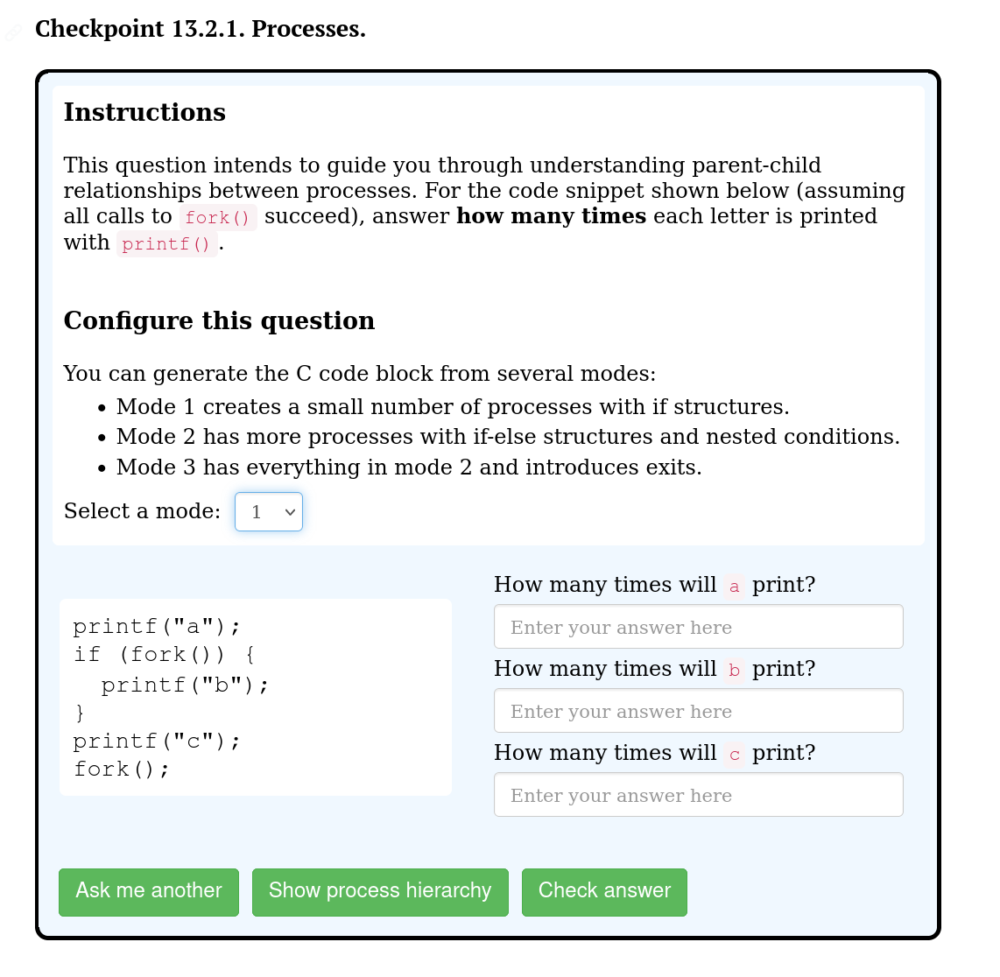
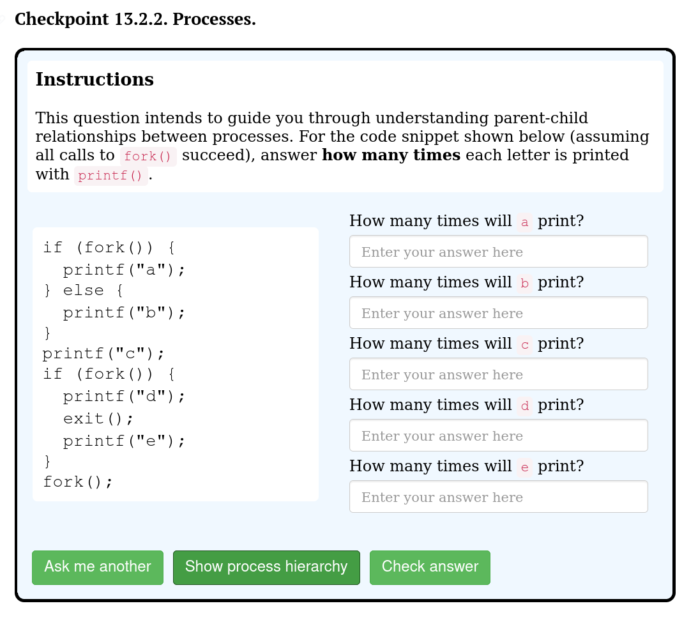
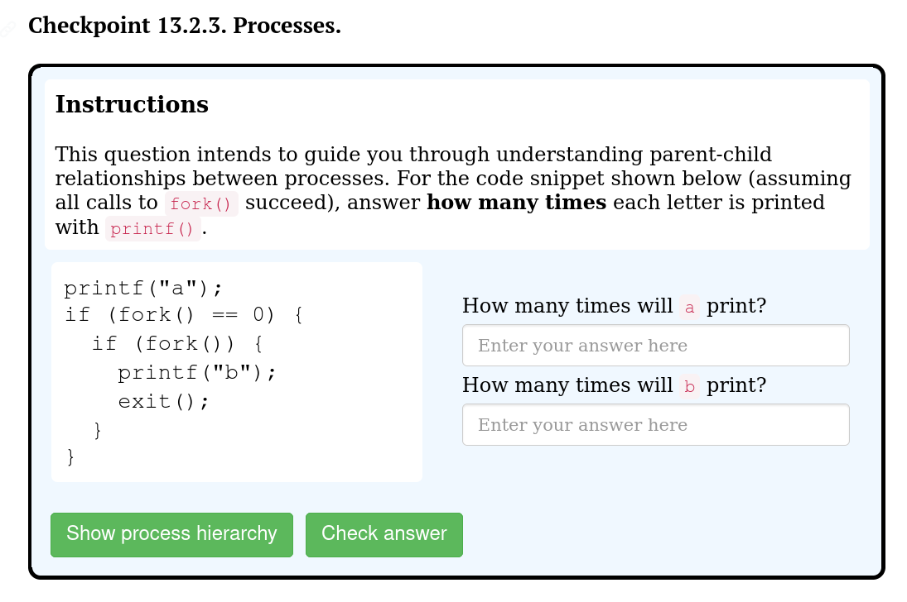

# Fork

The Fork problem can randomly generate a block of C-code with calls to `fork()`, `wait()`, `exit()`. The purpose is to help students understand concepts such as process state and hierarchy. With that goal, this component supports drawing **interactive** process hierarchy trees and execution timelines from the C-code.

## How to get it built

We need some support from the D3.js library (already added to dependencies), so make sure to run `npm install` again if you're using an older version of the node modules.

You can use the keyword `fork` to refer to this tool in a `.ptx` file. (Examples are provided below).

## Tunable parameters

The main way to control how this component behaves is by manipulating what the block of C-code contains. There are two places you can get it done. 

### In user interface



This is how the component looks like, in general. You can generate question from 3 modes. 

- **Mode 1**: 2 `fork()` calls, 2-3 `printf`, with `if` statements but not `else`.
- **Mode 2**: 3 `fork()` calls, 3-4 `printf`, with `if-else` statements and nested conditions.
- **Mode 3**: 4 `fork()` calls, 4 `printf`, everything in the previous modes, with `for` loops and `exit`.

*Please note that the number of forks and prints is what will show up in the C code, **not** how many of these operations will actually be executed in execution.*

### In PreTeXt file

You can also limit the flexibilities given to the user by making changes to `<script>` in `.ptx` files.

Again, the goal is to control what C-code we generate. Broadly, there are three approaches:

1. Generate a default question with 3 preset modes (see example 1). 
    - To do this, you don't need to add anything to `<script>`.
  
2. Generate a question with some preset parameters (see example 2).
    - To do this, you want to set `numForks`, `numPrints`, `hasElse`, `hasNest`, `hasExit`, and `hasLoop`.
    - *Note*: make sure that you pass in valid parameters in correct type, otherwise you'll get an error.
  
3. Generate a completely static question with a manually written C-code source string (see example 3).
    - To do this, you want to write a source string (format will be explain shortly), and you **must specify** `numForks` and `numPrints` for this string. 

Here are the specifics:
- `numForks`: (int, or a array of int) indicates how many `fork()` calls you want to have in C-code. 
- `numPrints`: (int, or a array of int) indicates how many print statements you want to have C-code.
- `hasElse`: (boolean) indicates if you want an `else` following a `if` block.
- `hasNest`: (boolean) indicates if you want if-else structures nested in another one. 
- `hasExit`: (boolean) indicates if you want call(s) to `exit()`.
- `hasLoop`: (boolean) indicates if you want `for` structures.

If you want to customize the instructions, you can add it to the `instruction` field (see example 3).

## Examples

### 1. A basic example


```html
<div class="ptx-runestone-container">
  <div class="runestone">
    <div data-component="processHierarchy" data-question_label="1" id="test_fork">
      <script type="application/json">
      </script>
    </div>
  </div>
</div>
```

```html
<div class="ptx-runestone-container">
  <div class="runestone">
    <div data-component="processTimeline" data-question_label="3" id="fork_timeline_default">
      <script type="application/json">
        {
          "preset-params": false
        }
      </script>
    </div> <!-- this component -->
  </div> <!--runestone-->
  <style>
    body{
      overflow-y: hidden;
      overflow-x: hidden;
    }
  </style>
</div> <!--ptx-runestone-container--> 
```

You don't even need the `<script>` section. It will generate the default complexity level menu and options from which users can choose.

### 2. An example with preset parameters



```html
<div class="ptx-runestone-container">
  <div class="runestone">
    <div data-component="processHierarchy" data-question_label="2" id="fork_preset_params">
      <script type="application/json">
        {
          "preset-params": true,
          "numForks" : 3,
          "numPrints" : 5,
          "hasElse" : true,
          "hasNest" : false,
          "hasExit" : true,
          "hasLoop" : true
        }
      </script>
    </div>
  </div> 
</div>
```

### 3. An example with hard-coded C-code



```html
<div class="ptx-runestone-container">
  <div class="runestone">
    <div data-component="processHierarchy" data-question_label="2" id="fork_preset_code">
      <script type="application/json">
        {
          "instruction" : "This question has manually written question, and this is a customized instruction.",
          "source" : "aF(,F(bx))",
          "numForks" : 2,
          "numPrints" : 2
        }
      </script>
    </div>
  </div> 
</div>
```

To write the `source` string:
  - `F()` means a fork call, it itself generates `fork();` in the C-code.
  - `F(,)` is also a fork call, but everything that comes before the comma is what the parent executes, and everything after the comma is what the child executes.
    - For example `F(a,b)` generates:
      ```C
      if (fork()) {
        printf("a");
      } else {
        printf("b");
      }
      ```
  - `X` means exit.
  - A letter that is not `F` nor `X` is what gets printed with `printf()`.

*Note*: DO NOT include any spaces in this source string. 


## Data structures and Algorithms
### Fork node and how is it built
- This data structure simulates a timeline of processes
- This data structure is NOT symmetrical, right and left children convey different things
- Left is intended to mean a process in a future timestep, and right is a child process.
#### pushCode()
- This method returns the corresponding transpiled C code from our internal string, and modify the data structure accordingly
- Any instructions pushed down the tree is propagated until we find no more future timesteps (no more lefts),
  then these nodes executes the corresponding instruction
#### Fork():
  - This method is quite messy due to instrumenting needed data for timeline.
  - For example of how this works, when a node 0.1 (name 0 at timestep 1) forks, it creates
  node 0.2 (process 0 at timestep 2) which has a child 1.0.
  - The rest of the checks are to ensure we propagate code correctly and
  to know which section of code results in which processes being created (was helpful for timeline highlight, DEPRECATED)

### generate source code:
  - Q: why did we not generate straight C code?
  - A: i thought this was easier to store internally and process. I could be wrong...  - Tony '25
  - To modify odds of certain if-else structures, I recommend changing how often F() and F(,) occur. You could also
  make changes to the insertion of a dash which will cause it to turn into a print() line.

### timeline (sequence generation & QA works; graphing deprecated)
  - fork-timeline.js is the same as fork-hierachy.js on the structure level and for basic functions like question rendering. We inherent the same F(,) code structure.
  - Code generation part:
    - The code generation part works, but may demand stress testing.
    - The code generation randomization and variability are empirically ideal, but may demand stress testing.
    - Please refer to `genSimpleWaitCode` for code generation, and `getPrintSequenceIncorrect` for answer generation.
  - Graphing part
    - we could draw a timeline based on the data structure using the timelineDraw.js and serialize() method from build.js.
    - there are support for path highlighting but this seemed quite confusing (and tricky to get the recursion right to highlight which code block cause which processes) so we disable it for now.
    - A separate attempt is also made with `this.graph = new ProcessGraph()` in `build.js`. This is attempting to build a algorithm graph (`G = {V, E}`). Due to limited time, however, this part is not fully implemented, nor the current part is robustly tested.
#### FUTURE
  - this could be a good backbone for exit-wait problems
  - My recommendations from trying to do this is generate code with no forks inside forks (which will cause grandchildrens)
  and have all children always exit, i.e all times there are 2 processes at most.
  - Drawing: I tried but I don't recommend actually try to make something like
  0.1 -> 0.2
  |       ^
  v       |
  1.0 -> 1.1
  inside the data structure. I would do this as a postprocessing step in timelineDraw.js
  and only have 0.1 and 1.0. The necessary assumptions are right children are always leaves, then we can draw the
  extra processes in the future even if they dont actually look like that in the data structure
  - How to generate valid and invalid combinations?
  - VALID
    - write an interleaving function ex: 123 and abc -> 1a2b3c OR 1abc23 OR ...etc.
    - I would recommend using seeds for the random generator for this ^
    - The possible number of ways to interleave 2 strings of n and m length is
    (n+m) choose n (the binomial coefficient function)
  - INVALID
    - parent pre-wait prints have finished, we see a post wait print, THEN at least 1 value from child.
